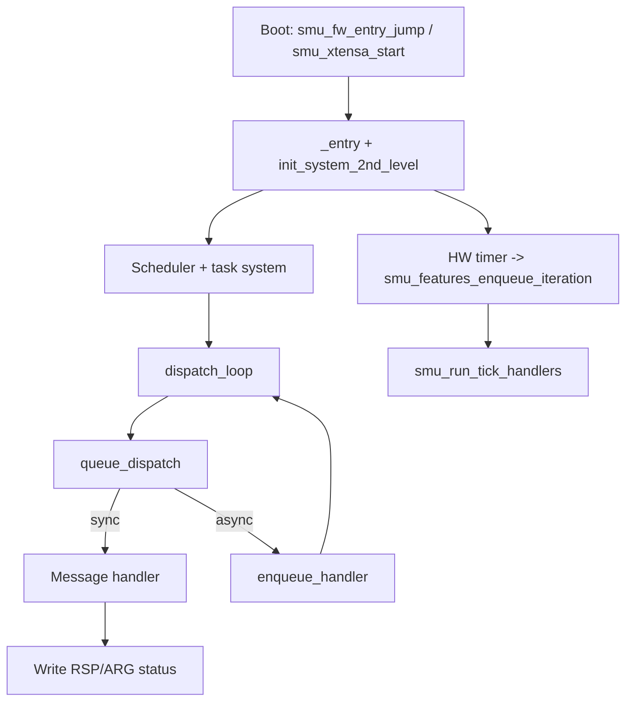

# AMD SMU Firmware Overview (Robin 5 / BC-250)

This document is AI summarization done by Codex-5.2 on extra high thinking.
It provides the internal architecture visible in the partially reverse
engineered firmware artifact: `smu.c` (decompiled firmware)

## 1. What the SMU is (in this firmware)

The System Management Unit (SMU) is an on-die microcontroller that enforces power,
thermal, and clock policies for the CPU/GPU/SoC. In this firmware it behaves like a
small OS:
- It boots an Xtensa core, sets up memory, and initializes global state.
- It runs a task scheduler with locks, events, and timeouts.
- It exposes a message-based interface to the host driver.
- It periodically runs policy "ticks" for power and thermal management.

## 2. Boot and initialization

The entry path (`smu_fw_entry_jump` / `smu_xtensa_start`) performs low-level CPU bring-up:
interrupts off, vector base set, caches and TLBs configured, then execution flows into
`_entry` after `.bss` is cleared by `smu_xtensa_start_3`.

From `_entry` the firmware initializes core structures and policies. A second-stage
init routine (`init_system_2nd_level`) sets up constants, core masks, VID tables, and
P-state tables, then programs a periodic hardware timer that drives SMU ticks via
`smu_features_enqueue_iteration`.

## 3. Execution model and scheduler

The firmware implements its own cooperative scheduler:
- `smu_task` holds context, priority, lock ownership, wait state, and timing info.
- `smu_task_state` includes READY, WAIT_LOCK, SLEEP, WAIT_EVENT, and SUSPENDED states.
- `dispatch_loop` pulls a hardware-context message, calls its function pointer, then
  exits the current task.
- `system_idle_loop` handles idle work and executes `waiti` when nothing is runnable.

Locks are explicit (`enum_lock`) and used to protect shared state such as P-state and
clock changes. `smu_task_exit_current` validates that locks are released before a task
finishes, otherwise it traps.

Timers and events provide asynchronous coordination:
- `smu_task_sleep_ticks` suspends a task for a number of ticks.
- `smu_event_wait` blocks until a signal or timeout.
- `smu_task_timers_tick` advances timeouts for sleeping or waiting tasks.

## 4. Message queues and command handling

The host/driver communicates through message queues. The firmware keeps:
- `queue_descriptor_table_offs_0[8]`, each entry with `ARG`, `RSP`, and `CMD` pointers.
- `queue_table_8`, a pointer to the per-queue handler tables.

Each handler entry (`queue_msg_handler`) contains a function pointer plus config bytes
that control guard behavior and synchronous/asynchronous execution.

`queue_dispatch` implements the core logic:
- Reads `CMD` to get a message ID.
- Validates the message ID and handler presence.
- Applies guard checks (`queue_guard_override`) for secure handlers.
- Executes handlers synchronously or enqueues them via `enqueue_handler`.
- Writes status codes like 0xfe (invalid/no handler), 0xfd (guard reject), or 0xfc (busy).

`export.html` shows these structures laid out in RAM, for example:
- `queue_descriptor_table_offs_0` around `0x0000700c`.
- `message_table_0` around `0x0000706c`, with subsequent tables for other queues.

## 5. Asynchronous work and tick scheduling

The SMU schedules work through `enqueue_handler`. Message handlers can run immediately
or be queued for later execution in the task loop.

A hardware timer periodically calls `smu_features_enqueue_iteration`, which:
- Enqueues `smu_run_tick_handlers`.
- Advances `smu_task_timers_tick` for sleeping/waiting tasks.
- Tracks iteration counts in `helper_7ae0`.

## 6. Feature framework (policy toggles)

Feature enablement is tracked by `smu_feature_mask` using the `smu_features_enum`
bitmask (thermal, DPM, PLL power down, TDC, EDC, STAPM, and others).

Each feature typically installs a periodic tick handler in `smu_tick_handlers[0x28]`
using `smu_set_tick_handler`. `smu_run_tick_handlers` iterates these handlers every
tick and records per-handler timing stats. This is the main mechanism for periodic
policy enforcement without a full RTOS.

## 7. Telemetry and metrics pipeline

Several structures capture sensor and policy state:
- `cpu_metrics_178` holds per-core metrics like VID, power, temperature, and frequency.
- `electrical_data` captures voltage, current, and power for CPU/GFX domains.
- `SmuMetricsTable_t` provides a compact summary for the host, including:
  core and L3 frequencies/temps, C0 residency, GPU/SoC clocks, volt/current/power,
  socket power, edge temperature, and throttler status.

The firmware maintains `SmuMetrics_Current` and `SmuMetrics_Average`:
- `table_6_tick_SmuMetrics` updates rolling averages.
- `table_6_smu2dram_SmuMetrics` packages metrics for transfer to DRAM.

## 8. Table transfer mechanism (SMU <-> DRAM)

Data exchange with the host uses table transfers:
- `PPSMC_MSG_TransferTableSmu2Dram` copies SMU tables to host memory.
- `PPSMC_MSG_TransferTableDram2Smu` copies host tables into SMU memory.

These handlers:
- Select a table ID and validate it.
- Check per-queue permission masks via `PTR_DAT_0000ca7c`.
- Dispatch to table-specific copy routines from pointer arrays
  `PTR_table_0_smu2dram_0000ca70` and `PTR_table_0_dram2smu_0000ca6c`.

`export.html` shows these pointer tables in RAM at `0x0000ca6c`/`0x0000ca70`/`0x0000ca7c`.

## 9. Control loops and policy building blocks

The firmware contains several policy building blocks:
- Thermal control uses `pd_controller_struct` (CPU and GPU).
- Current and power limiters appear as TDC/EDC features.
- STAPM (skin temperature aware power management) is represented by `stapm_*` structs.
- P-state tables (`p_state_clktable`, `p_state_ushort_table`, `p_state_byte_table`) and
  VID conversion (`convert_vid_to_voltage`) map policy decisions to actual clocks and voltages.

These loops are driven by the tick framework and coordinated with locks to prevent
conflicting state changes.

## 10. General flow

```
Boot -> init -> scheduler + timers

Host/Driver
  -> queue CMD/ARG
  -> queue_dispatch
  -> handler (sync) or enqueue_handler (async)
  -> response in RSP/ARG

Periodic timer
  -> smu_features_enqueue_iteration
  -> smu_run_tick_handlers
  -> update policy + metrics
  -> optional table transfer for telemetry
```

## 11. Mermaid overview diagram



## Glossary (quick)

- Queue: A command channel with CMD/ARG/RSP registers.
- Handler: Function for a specific message ID.
- P-state: Performance state mapping clocks to voltage.
- VID: Encoded voltage ID that maps to a physical voltage.
- DPM: Dynamic power management (clock/voltage scaling).
- TDC/EDC: Thermal/Electrical design current limits.
- STAPM: Skin temperature aware power management.
- Tick handler: Periodic function invoked by the SMU timer loop.

## Notes on uncertainty

Many struct fields are still unknown or partially named in `smu.c`.
The descriptions above are derived from naming hints, data flow, and cross-references
and should be treated as a high-level guide rather than definitive documentation.
